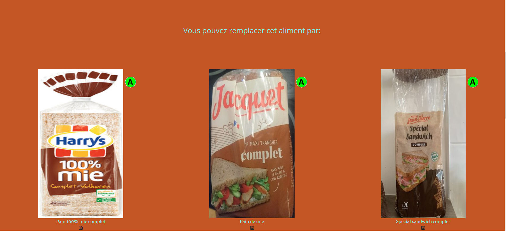
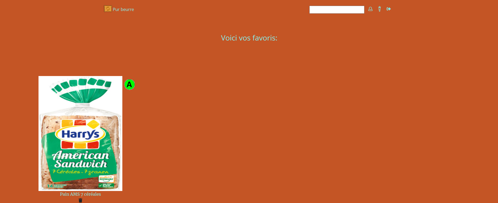

# Pur Beurre
You can access the app [here](https://django-lu-app.herokuapp.com/).

Pur Beurre is a Django application using the [Open Food Fact API](https://fr.openfoodfacts.org/) to offer to it's users the possibility to display healthy substitues for a specific product searched.
The nutritional score is also displayed next to the image to indicate the quality of the substitute. A being the highest score a product can receive.

Exemple of a search for bread:

The user can register and save the substitutes he wishes to keep track of.

